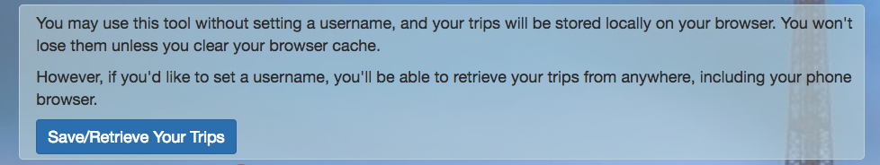
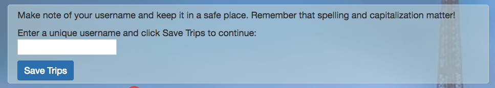
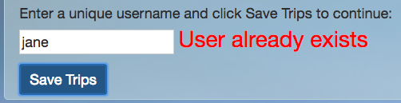
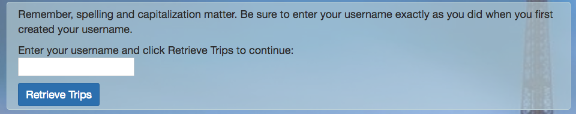
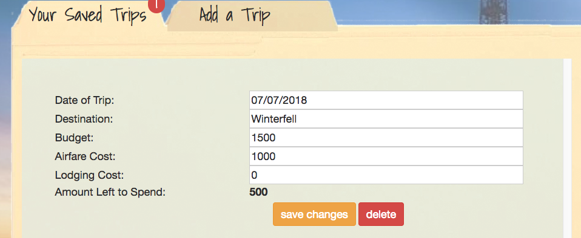

# Travel Buddy

Travel Buddy is a web app that allows you to budget and track your trips for work or play.  It is available at https://afternoon-badlands-72160.herokuapp.com/ .

Travel Buddy uses node.js, mongoDB, and Bootstrap.

Upon entering the page, users can immediately enter, edit, and delete trips. Until the user creates a username, all data is saved locally in the browser.

## Adding a Trip
Clicking on the Add a Trip tab/link reveals a form:

Once the form is completed, users can click on the "Your Saved Trips" tab to view their trips.  A badge showing the number of total trips saved also appears.

## Saved Trips
Saved trips are initially stored in the browser cache locally, but a username can be created to save the trips to a Mongo database.

### Creating a New User

Clicking the Save/Retrieve Your Trips button gives you an option between saving as a new user, or as a returning user.

Clicking New User brings you to the username creation field

If you successfully create a username that is unique, the website welcomes you, and gives you a button to continue saving your trips, and to log out if you so choose.  Logging out clears the cache in the browser and trips must be retrieved afterwards through the returning user interface.

However, if you choose a username that is already in use, you will be warned that the username exists and must try again.

### Returning Users
Returning users can click through the interface to arrive at the Returning User interface.

Once the user enters their username, trips will be retrieved and displayed on screen.

## Editing Trips
Trips that have already been added can be edited from the Your Saved Trips tab at any time.  Clicking the Save button will commit your changes.

## Deleting Trips
Trips that have been completed or are otherwise no longer needed can be deleted using the delete button on the Your Saved Trips tab.

